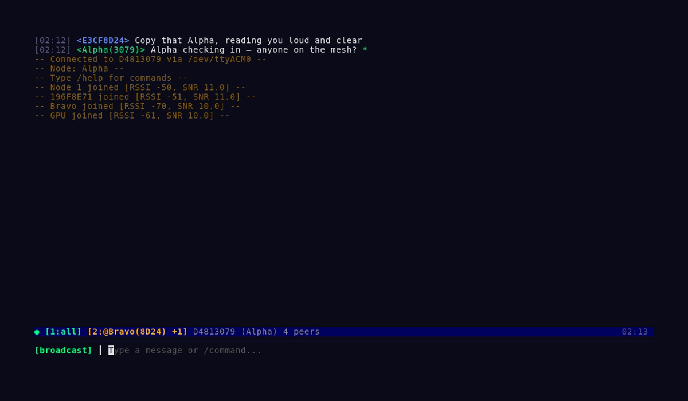
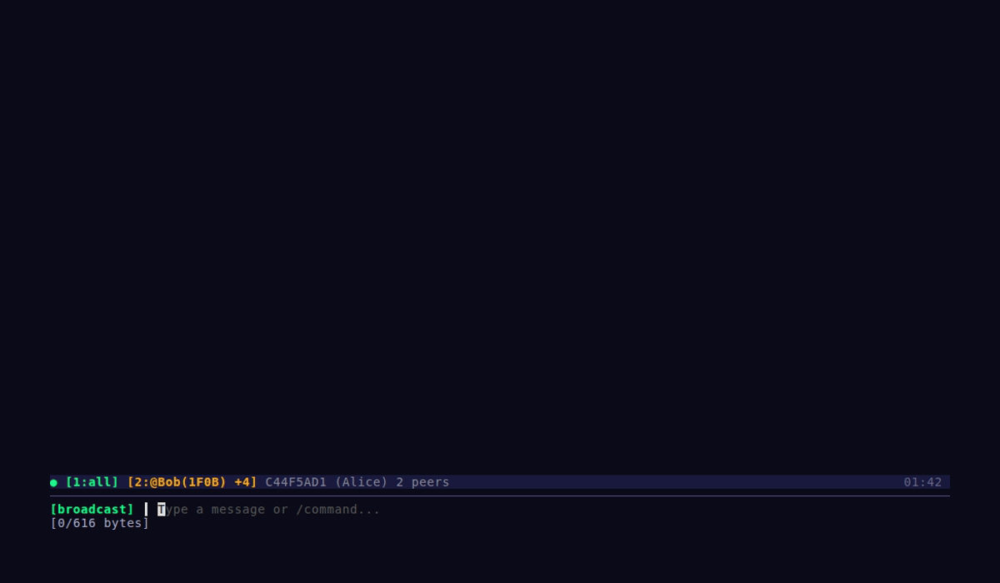

# bramble-cli

`bramble-cli` is the command-line and terminal UI client for Bramble mesh nodes. Use it to connect over serial, WebSocket, or BLE; send and monitor mesh traffic; inspect node health; and manage configuration from a laptop shell or an interactive full-screen TUI.

It is built on [bramble-go](https://github.com/justinlindh/bramble-go), and follows its protocol compatibility (`MinProtocolVersion=0.1.0`, `MaxProtocolVersion=0.5.0`).

## Table of Contents

- [Install](#install)
- [Quick Start](#quick-start)
- [Terminal UI](#terminal-ui)
- [Global Flags](#global-flags)
- [Commands](#commands)
  - [Messaging](#messaging)
  - [Monitoring and Diagnostics](#monitoring-and-diagnostics)
  - [Configuration](#configuration)
  - [Location](#location)
  - [System and Network](#system-and-network)
- [Shell Completion](#shell-completion)
- [JSON Output](#json-output)
- [Examples](#examples)
- [Quality Checks](#quality-checks)
- [Release Process](#release-process)
- [Public Publishing Checklist](#public-publishing-checklist)
- [License](#license)

## Install

```bash
go install github.com/justinlindh/bramble-cli/cmd/bramble@latest
```

Or build from source:

```bash
git clone https://github.com/justinlindh/bramble-cli.git
cd bramble-cli
make build
```

`make build` injects the version (from `git describe --tags --dirty`) via
ldflags; a bare `go build` produces a binary that reports version `dev`:

```bash
go build -ldflags "-X github.com/justinlindh/bramble-cli/internal/commands.version=$(git describe --tags --dirty)" -o bramble ./cmd/bramble
```

## Quick Start

Auto-detect USB serial (scans `/dev/ttyUSB*` and `/dev/ttyACM*`):

```bash
bramble status
```

Specify a serial port:

```bash
bramble --port /dev/ttyUSB0 status
```

WebSocket transport:

```bash
bramble --transport ws://192.168.4.1/ws status
```

Bluetooth Low Energy transport:

```bash
bramble --ble Bramble status
```

> Note: IP addresses and hostnames shown in examples are placeholders from local test networks. Replace them with values from your own environment.

## Terminal UI

Launch the interactive TUI:

```bash
bramble tui --transport ws://192.0.2.0/ws
bramble tui --port /dev/ttyUSB0
```

The TUI is designed as an IRC-style operations console for Bramble. It combines live chat, system events, slash-command output, and connection status in a single full-screen view so you can operate a node without bouncing between multiple terminal commands.





### What it shows

- **Unified scrollback:** inbound/outbound messages, delivery updates, and node events
- **Status bar:** transport state, active buffers, unread counts, peer counts, clock
- **Command input:** message composition plus slash commands like `/nodes`, `/stats`, `/config`, `/location`
- **Buffer model:** broadcast, channel, and DM buffers with quick keyboard switching
- **Mouse support:** scroll wheel for history, click a nickname to open a DM, click status bar tabs to switch buffers

### Slash Commands

| Command | Description |
|---------|-------------|
| `/b`, `/broadcast` | Switch to broadcast buffer |
| `/dm <addr\|name>` | Open or switch to a DM buffer |
| `/msg <addr\|name> <text>` | Send a DM inline without switching buffers |
| `/critical <text>` | Send as critical priority (more retries; emergency airtime tier) |
| `/ch <sel>` | Switch buffer (`/ch 2`, `/ch all`, `/ch mesh:1`) |
| `/w`, `/windows` | List open buffers |
| `/close` | Close the current buffer |
| `/nodes` | Show neighbors and routes |
| `/stats` | Show node statistics (uptime, TX/RX counts, airtime) |
| `/config` | Show node configuration |
| `/config set <key> <value>` | Set a config value (e.g. `/config set name my-node`) |
| `/location`, `/loc` | Show GPS fix and peer locations |
| `/alias <addr> <name>` | Set a display alias for a peer address |
| `/nick <name>` | Change node display name (max 32 chars) |
| `/me <action>` | Send an action message (*Nick does something*) |
| `/slap <target>` | Classic mIRC trout-slap action |
| `/probe` | Send a network reachability probe |
| `/ping` | Ping the connected node |
| `/reboot` | Reboot the node (with confirmation) |
| `/clear` | Clear scrollback history |
| `/mouse [on\|off]` | Toggle mouse capture (Shift+click/drag bypasses) |
| `/help` | Show command help |
| `/quit` | Exit the TUI |

**Keyboard shortcuts:** Alt+1–9 to switch buffers, Ctrl+N/Ctrl+P for next/prev, PgUp/PgDn to scroll history.

## Global Flags

| Flag | Short | Description |
|------|-------|-------------|
| `--ble <name>` | `-b` | BLE device name to scan for (example: `Bramble`) |
| `--port <path>` | `-p` | Serial port path (example: `/dev/ttyUSB0`) |
| `--transport <url>` | `-t` | WebSocket transport URL (example: `ws://192.168.4.1/ws`) |
| `--token` | | Auth token for node connection |
| `--json` | | Output command results as JSON |

## Commands

### Messaging

- `bramble send <address> <message>` — send a unicast message
- `bramble broadcast <message>` — send a mesh-wide message
- `bramble channels list` — list configured channels
- `bramble channels add <name> [psk]` — add a channel
- `bramble channels remove <index>` — remove a channel
- `bramble channels set-default <index>` — set default outgoing channel

```bash
bramble send CAFEBABE "hello there"
bramble broadcast "hello everyone"
bramble broadcast --channel 2 "hello channel 2"
bramble broadcast --wait-delivery 10 "delivery telemetry please"
```

### Monitoring and Diagnostics

- `bramble monitor` — stream real-time node events
- `bramble traffic monitor` — live TX/RX telemetry stream
- `bramble traffic export` — export ring-buffer traffic telemetry to JSONL
- `bramble peers` — list direct radio neighbors
- `bramble routes` — show routing table
- `bramble ping` — ping connected node
- `bramble probe` — send network probe

```bash
bramble monitor --topic wifi,gps,location
bramble monitor --messages
bramble monitor --events
bramble traffic monitor --tx-only
bramble traffic export --format jsonl > traffic-events.jsonl
```

### Configuration

- `bramble config get` — print full node configuration
- `bramble config set-name <name>` — set node display name
- `bramble config set-radio` — update radio parameters

```bash
bramble config set-name my-node
bramble config set-radio --freq 915.0 --sf 10 --bw 125 --cr 5 --txpower 20
```

### Location

- `bramble location status` — show known peer locations
- `bramble location get-config` — show canonical location config
- `bramble location set-config` — set canonical location policy
- `bramble location set-contact <address> <tier>` — quick per-peer rule
- `bramble location remove-contact <address>` — remove per-peer rule
- `bramble location share-once <address>` — send one-time location update

```bash
bramble location set-config --enabled --default-tier full --interval-s 30 --source gps
bramble location get-config --json
```

### System and Network

- `bramble status` — show node address, firmware, radio, peers, counters, uptime
- `bramble discover` — scan local network for Bramble nodes via mDNS
- `bramble wifi` — show WiFi mode and link status
- `bramble mesh-test` — automated mesh reliability test (multi-node broadcast/delivery)
- `bramble pair` — retrieve auth token from a serial-connected device for WebSocket auth
- `bramble ota --url <url>` — trigger OTA firmware update
- `bramble reboot` — reboot node
- `bramble tui` — launch full-screen interactive terminal UI

```bash
bramble status
bramble discover --timeout 10s
bramble ota --url http://<ota-host>:8080/firmware/bramble.bin
```

## Shell Completion

Bramble supports shell completions via Cobra:

```bash
# Bash
bramble completion bash > /etc/bash_completion.d/bramble

# Zsh
bramble completion zsh > "${fpath[1]}/_bramble"

# Fish
bramble completion fish > ~/.config/fish/completions/bramble.fish
```

## JSON Output

All commands support `--json` for machine-readable output:

```bash
bramble --json status | jq .address
bramble --json peers | jq '.[].rssi'
bramble monitor --topic location --json
```

## Examples

See the [`examples/`](examples/) directory for common usage patterns:

- [`01-connect.sh`](examples/01-connect.sh) — BLE, WiFi, and serial connection flows
- [`02-send-receive.sh`](examples/02-send-receive.sh) — basic send/receive
- [`03-channels.sh`](examples/03-channels.sh) — channel operations
- [`04-location.sh`](examples/04-location.sh) — location sharing
- [`05-monitor.sh`](examples/05-monitor.sh) — monitor and debug output

## Quality Checks

The repository includes a dedicated quality workflow at `.gitea/workflows/quality.yml`.
See [`docs/README.md`](docs/README.md) for docs index and status.

- **Required checks (Phase C):**
  - `go test ./...`
  - `go vet ./...`
  - `golangci-lint run ./...`
  - `shellcheck scripts/*.sh examples/*.sh`
  - `bash scripts/check-doc-drift.sh`
  - `npx --yes markdownlint-cli2 "**/*.md"`
  - `govulncheck ./...`
- **Advisory checks:**
  - `actionlint`

`govulncheck ./...` is required in Phase C by default because current scans show no vulnerability backlog and produce high-signal output (`No vulnerabilities found.`).

Staged promotion policy, Phase B → C migration notes, required-vs-advisory matrix, and explicit rollback levers are documented in [`docs/quality-policy.md`](docs/quality-policy.md).

To run local required + advisory checks before pushing:

```bash
go test ./...
go vet ./...
go install github.com/golangci/golangci-lint/cmd/golangci-lint@latest
golangci-lint run ./...

# ShellCheck (install once; package name may vary by distro)
shellcheck scripts/*.sh examples/*.sh

# Docs correctness + markdown (required in Phase C)
bash scripts/check-doc-drift.sh
npx --yes markdownlint-cli2 "**/*.md"

# govulncheck is required in CI Phase C
go install golang.org/x/vuln/cmd/govulncheck@latest
govulncheck ./...

# Optional advisory check
go install github.com/rhysd/actionlint/cmd/actionlint@latest
actionlint
```

### Local Git hooks with pre-commit

Install hooks once in your clone:

```bash
# Pre-commit checks (format, lint, shellcheck, markdown)
pre-commit install

# Optional: also install pre-push checks (docs drift)
pre-commit install -t pre-push
```

Run hooks on demand:

```bash
pre-commit run --all-files
pre-commit run --hook-stage pre-push check-doc-drift
```

Emergency bypass (use sparingly, and fix immediately after):

```bash
# Skip specific pre-commit hooks
SKIP=golangci-lint,markdownlint-cli2 git commit -m "..."

# Bypass all hooks for one commit/push
git commit --no-verify -m "..."
git push --no-verify
```

## Release Process

Release automation and required secrets are documented in [`docs/release.md`](docs/release.md).

## Public Publishing Checklist

Before publishing externally, run through [`docs/public-publishing.md`](docs/public-publishing.md).

## License

MIT
